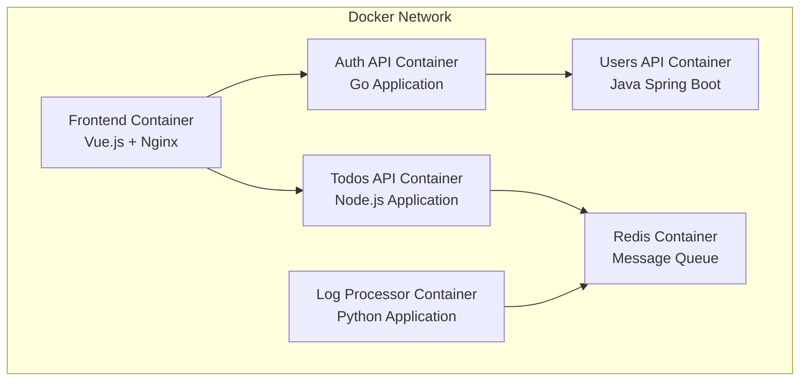

# Design Document

## Overview

This design outlines the containerization strategy for a microservices application consisting of five services (Frontend, Auth API, Todos API, Users API, Log Message Processor) plus a Redis queue. The solution uses Docker containers orchestrated by Docker Compose to provide a unified, reproducible deployment environment.

## Architecture

### Container Architecture



### Service Communication Flow

1. **Frontend** serves the Vue.js application and proxies API calls
2. **Auth API** validates credentials and issues JWT tokens
3. **Todos API** manages todo operations and publishes events to Redis
4. **Users API** provides user profile data
5. **Log Processor** consumes messages from Redis queue
6. **Redis** acts as message broker between Todos API and Log Processor

## Components and Interfaces

### Frontend Container

- **Base Image**: `node:14-alpine` for build, `nginx:alpine` for serving
- **Build Strategy**: Multi-stage build (build assets, then serve with Nginx)
- **Port**: 8080
- **Environment Variables**:
  - `AUTH_API_ADDRESS`: URL for auth service
  - `TODOS_API_ADDRESS`: URL for todos service
- **Volume Mounts**: None required
- **Dependencies**: Auth API, Todos API

### Auth API Container

- **Base Image**: `golang:1.21-alpine` for build, `alpine:latest` for runtime
- **Build Strategy**: Multi-stage build (compile Go binary, then minimal runtime)
- **Port**: 8081
- **Environment Variables**:
  - `AUTH_API_PORT`: Service port
  - `USERS_API_ADDRESS`: URL for users service
  - `JWT_SECRET`: Secret for JWT signing
  - `ZIPKIN_URL`: Optional tracing endpoint
- **Dependencies**: Users API

### Todos API Container

- **Base Image**: `node:14-alpine`
- **Build Strategy**: Single stage (install dependencies and run)
- **Port**: 8082
- **Environment Variables**:
  - `TODO_API_PORT`: Service port
  - `JWT_SECRET`: Secret for JWT validation
  - `REDIS_HOST`: Redis hostname
  - `REDIS_PORT`: Redis port
  - `REDIS_CHANNEL`: Redis channel name
  - `ZIPKIN_URL`: Optional tracing endpoint
- **Dependencies**: Redis

### Users API Container

- **Base Image**: `openjdk:8-jdk-alpine` for build, `openjdk:8-jre-alpine` for runtime
- **Build Strategy**: Multi-stage build (Maven build, then minimal JRE runtime)
- **Port**: 8083
- **Environment Variables**:
  - `SERVER_PORT`: Service port
  - `JWT_SECRET`: Secret for JWT validation
  - `ZIPKIN_URL`: Optional tracing endpoint
- **Volume Mounts**: None (uses embedded H2 database)
- **Dependencies**: None (self-contained)

### Log Message Processor Container

- **Base Image**: `python:3.9-alpine`
- **Build Strategy**: Single stage (install dependencies and run)
- **Port**: None (background service)
- **Environment Variables**:
  - `REDIS_HOST`: Redis hostname
  - `REDIS_PORT`: Redis port
  - `REDIS_CHANNEL`: Redis channel name
  - `ZIPKIN_URL`: Optional tracing endpoint
- **Dependencies**: Redis

### Redis Container

- **Base Image**: `redis:7-alpine`
- **Build Strategy**: Use official image as-is
- **Port**: 6379
- **Environment Variables**: None required
- **Volume Mounts**: Optional persistent storage
- **Dependencies**: None

## Data Models

### Docker Compose Service Definitions

```yaml
services:
  frontend:
    build: ./frontend
    ports: ["8080:80"]
    environment: [AUTH_API_ADDRESS, TODOS_API_ADDRESS]
    depends_on: [auth-api, todos-api]

  auth-api:
    build: ./auth-api
    ports: ["8081:8081"]
    environment: [AUTH_API_PORT, USERS_API_ADDRESS, JWT_SECRET]
    depends_on: [users-api]

  todos-api:
    build: ./todos-api
    ports: ["8082:8082"]
    environment:
      [TODO_API_PORT, JWT_SECRET, REDIS_HOST, REDIS_PORT, REDIS_CHANNEL]
    depends_on: [redis-queue]

  users-api:
    build: ./users-api
    ports: ["8083:8083"]
    environment: [SERVER_PORT, JWT_SECRET]

  log-message-processor:
    build: ./log-message-processor
    environment: [REDIS_HOST, REDIS_PORT, REDIS_CHANNEL]
    depends_on: [redis-queue]

  redis-queue:
    image: redis:7-alpine
    ports: ["6379:6379"]
```

### Environment Configuration Strategy

1. **Default Values**: Defined in `.env` file at repository root
2. **Override Capability**: Environment variables can be overridden at runtime
3. **Service Discovery**: Services use Docker Compose service names as hostnames
4. **Port Mapping**: Internal container ports mapped to host ports for development

## Error Handling

### Container Startup Failures

- **Health Checks**: Implement health check endpoints for each service
- **Dependency Management**: Use `depends_on` with health conditions
- **Restart Policies**: Configure appropriate restart policies for each service
- **Logging**: Ensure all services log to stdout/stderr for Docker log collection

### Network Communication Failures

- **Retry Logic**: Services implement retry logic for dependent service calls
- **Circuit Breakers**: Implement circuit breaker pattern for external service calls
- **Graceful Degradation**: Services handle dependency failures gracefully
- **Connection Pooling**: Use connection pooling for database and Redis connections

### Resource Constraints

- **Memory Limits**: Set appropriate memory limits for each container
- **CPU Limits**: Configure CPU limits to prevent resource starvation
- **Disk Space**: Monitor and manage disk space usage
- **Network Bandwidth**: Consider network bandwidth limitations

## Testing Strategy

### Container Testing

1. **Build Testing**: Verify each Dockerfile builds successfully
2. **Runtime Testing**: Test each container starts and responds to health checks
3. **Integration Testing**: Verify service-to-service communication works
4. **End-to-End Testing**: Test complete user workflows through the application

### Docker Compose Testing

1. **Startup Testing**: Verify `docker compose up -d` starts all services
2. **Dependency Testing**: Verify services start in correct order
3. **Network Testing**: Verify inter-service communication works
4. **Environment Testing**: Verify environment variable configuration works

### Performance Testing

1. **Resource Usage**: Monitor CPU, memory, and disk usage of containers
2. **Response Times**: Measure API response times in containerized environment
3. **Throughput**: Test application throughput under load
4. **Scalability**: Test horizontal scaling capabilities

### Security Testing

1. **Image Scanning**: Scan container images for vulnerabilities
2. **Network Security**: Verify network isolation and security
3. **Secret Management**: Verify sensitive data is handled securely
4. **Access Control**: Verify proper access controls are in place

## Deployment Considerations

### Development Environment

- **Hot Reloading**: Configure volume mounts for development hot reloading
- **Debug Ports**: Expose debug ports for development debugging
- **Log Aggregation**: Configure centralized logging for development
- **Database Persistence**: Use volumes for database persistence in development

### Production Environment

- **Image Registry**: Push images to container registry for production deployment
- **Orchestration**: Consider Kubernetes or Docker Swarm for production orchestration
- **Load Balancing**: Implement load balancing for high availability
- **Monitoring**: Implement comprehensive monitoring and alerting
- **Backup Strategy**: Implement backup strategy for persistent data
- **Security Hardening**: Apply security hardening best practices

### CI/CD Integration

- **Automated Building**: Integrate container building into CI/CD pipeline
- **Automated Testing**: Run container tests in CI/CD pipeline
- **Image Versioning**: Implement proper image versioning strategy
- **Deployment Automation**: Automate deployment to different environments
