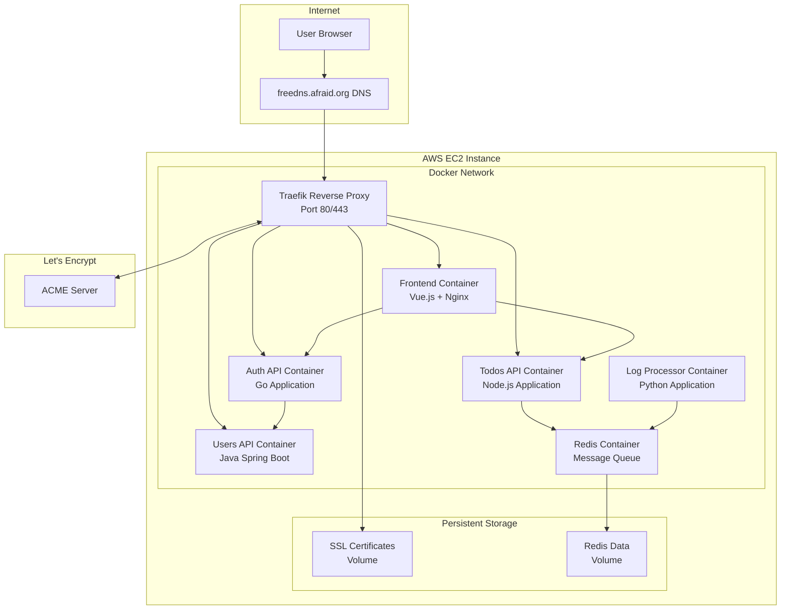
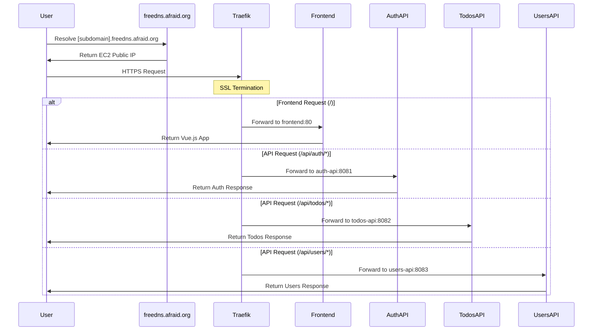

# Design Document

## Overview

This design outlines the implementation of Traefik as a reverse proxy with automatic SSL certificate management for the containerized microservices application deployed on AWS EC2. The solution uses Traefik v3.0 to provide secure HTTPS access through a free subdomain from freedns.afraid.org, with automatic Let's Encrypt certificate provisioning, HTTP to HTTPS redirection, and path-based routing to backend services.

## Architecture

### High-Level Architecture



### Request Flow Architecture



## Components and Interfaces

### Traefik Configuration

**Service Definition:**

- **Image**: `traefik:v3.0`
- **Ports**: 80 (HTTP), 443 (HTTPS), 8080 (Dashboard)
- **Configuration Method**: Dynamic configuration via Docker labels
- **Certificate Storage**: Persistent volume for Let's Encrypt certificates
- **Network**: Connected to existing `app-network`

**Key Configuration Features:**

- Automatic service discovery via Docker labels
- Let's Encrypt ACME challenge (HTTP-01)
- HTTP to HTTPS redirection
- Path-based routing rules
- Health checks and load balancing
- Dashboard for monitoring and debugging

### SSL Certificate Management

**Let's Encrypt Integration:**

- **Challenge Type**: HTTP-01 (suitable for single domain)
- **Certificate Storage**: `/letsencrypt` volume mount
- **Renewal**: Automatic renewal 30 days before expiration
- **Staging Environment**: Configurable via environment variable
- **Production Environment**: Uses Let's Encrypt production servers

**Certificate Persistence:**

- Certificates stored in Docker volume `traefik-certs`
- Survives container restarts and updates
- Proper file permissions and security

### Routing Configuration

**Frontend Routing:**

- **Rule**: `Host([subdomain].freedns.afraid.org) && PathPrefix(/)`
- **Priority**: 1 (lowest, catch-all)
- **Target**: `frontend:80`
- **Middleware**: HTTPS redirect

**API Routing:**

- **Auth API Rule**: `Host([subdomain].freedns.afraid.org) && PathPrefix(/api/auth)`
- **Todos API Rule**: `Host([subdomain].freedns.afraid.org) && PathPrefix(/api/todos)`
- **Users API Rule**: `Host([subdomain].freedns.afraid.org) && PathPrefix(/api/users)`
- **Priority**: 10 (higher than frontend)
- **Path Stripping**: Remove `/api/auth`, `/api/todos`, `/api/users` prefixes
- **Middleware**: HTTPS redirect, path stripping

### Docker Labels Strategy

**Traefik Service Labels:**

```yaml
labels:
  - "traefik.enable=true"
  - "traefik.http.routers.traefik.rule=Host(`${DOMAIN}`) && PathPrefix(`/dashboard`)"
  - "traefik.http.routers.traefik.tls.certresolver=letsencrypt"
  - "traefik.http.services.traefik.loadbalancer.server.port=8080"
```

**Frontend Service Labels:**

```yaml
labels:
  - "traefik.enable=true"
  - "traefik.http.routers.frontend.rule=Host(`${DOMAIN}`)"
  - "traefik.http.routers.frontend.tls.certresolver=letsencrypt"
  - "traefik.http.services.frontend.loadbalancer.server.port=80"
```

**API Service Labels Pattern:**

```yaml
labels:
  - "traefik.enable=true"
  - "traefik.http.routers.{service}.rule=Host(`${DOMAIN}`) && PathPrefix(`/api/{service}`)"
  - "traefik.http.routers.{service}.tls.certresolver=letsencrypt"
  - "traefik.http.middlewares.{service}-stripprefix.stripprefix.prefixes=/api/{service}"
  - "traefik.http.routers.{service}.middlewares={service}-stripprefix"
  - "traefik.http.services.{service}.loadbalancer.server.port={port}"
```

## Data Models

### Environment Variables

**New Traefik-specific variables:**

```bash
# Domain Configuration
DOMAIN=[subdomain].freedns.afraid.org
ACME_EMAIL=your-email@example.com
LETS_ENCRYPT_ENVIRONMENT=staging  # or 'production'

# Traefik Configuration
TRAEFIK_DASHBOARD_ENABLED=true
TRAEFIK_LOG_LEVEL=INFO
TRAEFIK_API_INSECURE=false

# EC2 Specific
EC2_PUBLIC_IP=x.x.x.x  # For reference/documentation
```

**Updated Service Configuration:**

- Remove direct port mappings for backend services (except for debugging)
- Services communicate internally via Docker network
- Only Traefik exposes ports 80 and 443 to host

### Docker Compose Service Updates

**Traefik Service Addition:**

```yaml
traefik:
  image: traefik:v3.0
  container_name: traefik
  restart: unless-stopped
  ports:
    - "80:80"
    - "443:443"
    - "8080:8080" # Dashboard (optional)
  volumes:
    - /var/run/docker.sock:/var/run/docker.sock:ro
    - traefik-certs:/letsencrypt
  environment:
    - TRAEFIK_API_DASHBOARD=${TRAEFIK_DASHBOARD_ENABLED:-true}
    - TRAEFIK_CERTIFICATESRESOLVERS_LETSENCRYPT_ACME_EMAIL=${ACME_EMAIL}
    - TRAEFIK_CERTIFICATESRESOLVERS_LETSENCRYPT_ACME_STORAGE=/letsencrypt/acme.json
  networks:
    - app-network
```

**Service Label Updates:**

- Add Traefik labels to all services that need external access
- Remove direct port mappings for internal services
- Configure path-based routing and SSL termination

### Security Group Configuration

**Required AWS EC2 Security Group Rules:**

```
Inbound Rules:
- HTTP (80): 0.0.0.0/0 (for Let's Encrypt challenges and redirects)
- HTTPS (443): 0.0.0.0/0 (for secure application access)
- SSH (22): Your IP/32 (for administration)
- Custom (8080): Your IP/32 (optional, for Traefik dashboard)

Outbound Rules:
- All traffic: 0.0.0.0/0 (for Let's Encrypt, package updates, etc.)
```

## Error Handling

### SSL Certificate Provisioning Failures

**Challenge Failures:**

- **HTTP-01 Challenge Issues**: Ensure port 80 is accessible and domain points to correct IP
- **Rate Limiting**: Use Let's Encrypt staging environment for testing
- **DNS Propagation**: Allow time for DNS changes to propagate
- **Firewall Issues**: Verify security groups and local firewall rules

**Fallback Strategies:**

- Start with Let's Encrypt staging environment
- Implement health checks for certificate status
- Log detailed ACME challenge information
- Provide clear error messages for common issues

### Service Discovery Failures

**Docker Socket Issues:**

- Verify Docker socket permissions and mounting
- Implement retry logic for Docker API calls
- Monitor Docker daemon health

**Label Configuration Errors:**

- Validate label syntax and values
- Implement configuration validation
- Provide clear error messages for misconfigurations

### Network Communication Failures

**Backend Service Unavailability:**

- Configure health checks for all services
- Implement circuit breaker patterns
- Return appropriate HTTP status codes (503 Service Unavailable)
- Configure retry policies and timeouts

**DNS Resolution Issues:**

- Verify freedns.afraid.org configuration
- Monitor DNS propagation status
- Implement DNS health checks

## Testing Strategy

### Local Development Testing

**Staging Environment Setup:**

1. Use Let's Encrypt staging environment to avoid rate limits
2. Configure local domain mapping for testing
3. Test certificate provisioning and renewal
4. Verify all routing rules work correctly

**Integration Testing:**

1. Test HTTP to HTTPS redirection
2. Verify all API endpoints are accessible
3. Test authentication flows through proxy
4. Validate SSL certificate installation

### Production Deployment Testing

**Pre-deployment Validation:**

1. Verify DNS configuration points to EC2 instance
2. Test security group configuration
3. Validate Docker Compose configuration
4. Test service startup sequence

**Post-deployment Validation:**

1. Verify SSL certificate provisioning
2. Test all application endpoints
3. Validate authentication and authorization flows
4. Monitor certificate renewal process

### Performance Testing

**Load Testing:**

1. Test Traefik performance under load
2. Measure SSL termination overhead
3. Validate backend service scaling
4. Test connection pooling and keep-alive

**Resource Monitoring:**

1. Monitor CPU and memory usage
2. Track SSL handshake performance
3. Monitor certificate storage usage
4. Validate log rotation and cleanup

## Deployment Considerations

### EC2 Instance Requirements

**Instance Specifications:**

- **Minimum**: t3.small (2 vCPU, 2 GB RAM)
- **Recommended**: t3.medium (2 vCPU, 4 GB RAM)
- **Storage**: 20 GB EBS volume (GP3)
- **Network**: Enhanced networking enabled

**System Configuration:**

- Docker and Docker Compose installed
- Automatic startup of Docker service
- Log rotation configured
- System monitoring and alerting

### DNS Configuration

**freedns.afraid.org Setup:**

1. Register for free account at freedns.afraid.org
2. Create subdomain pointing to EC2 public IP
3. Configure A record with appropriate TTL
4. Verify DNS propagation using dig/nslookup

**DNS Monitoring:**

- Monitor DNS resolution health
- Set up alerts for DNS failures
- Document DNS configuration for disaster recovery

### Security Hardening

**Container Security:**

- Run containers with non-root users where possible
- Implement resource limits and quotas
- Regular security updates for base images
- Vulnerability scanning for container images

**Network Security:**

- Minimize exposed ports
- Use Docker networks for service isolation
- Implement proper firewall rules
- Regular security group audits

**Certificate Security:**

- Secure certificate storage permissions
- Regular certificate rotation
- Monitor certificate expiration
- Implement certificate backup strategy

### Monitoring and Logging

**Application Monitoring:**

- Traefik dashboard for real-time monitoring
- Health check endpoints for all services
- Performance metrics collection
- Error rate and latency monitoring

**Log Management:**

- Centralized logging for all containers
- Log rotation and retention policies
- Structured logging for better analysis
- Alert configuration for critical errors

**Backup and Recovery:**

- Regular backup of certificate data
- Configuration backup and version control
- Disaster recovery procedures
- Service restoration testing
